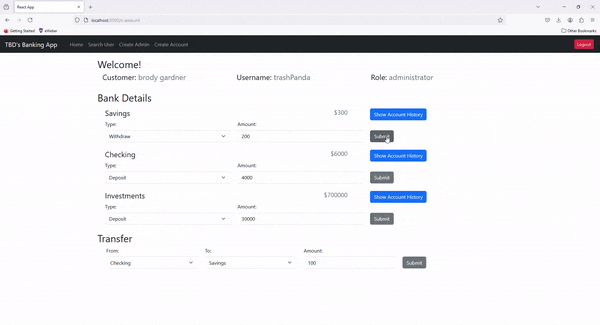
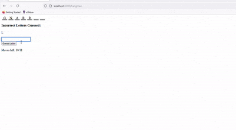
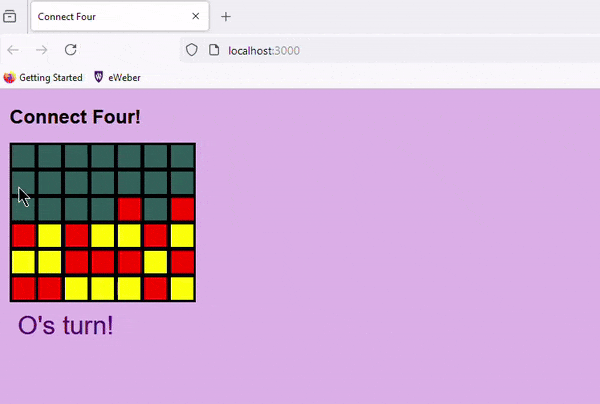
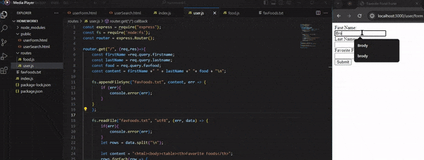

# Brodys Portfolio

Welcome!

I'm currently a computer science student at Weber State University and a programmer at Pye Barker FS. At Pye, I focus on creating applications that streamline user interaction with Sedona. 
I've contributed to two key projects:
- **Parts Consolidation Tool:** Designed to remove and consolidate duplicate parts in our parts table, improving data accuracy. The parts table has become quite giant as the company brings in new businesses and with
    this tool it helps provide a more streamline way for parts to be consolidated and transfer respective data to one single part.
-  **Workspace Application:** Currently in development, this app aims to remove traffic from Sedona by providing a  workspace for sales and other team members, enhancing their experience when accessing customer data.
  
This repository showcases some of my group and individual projects, including a Banking App, Hangman Game, and more.
These projects demonstrate the skills and knowledge I've gained throughout my software engineering journey. Enjoy exploring!

## Table of Contents

1. [Banking App](#banking-app-group)
2. [Hangman Game](#hangman-game)
3. [Connect Four](#Connect-Four)
4. [Read Write Text File](#Read-Write)
5. [Web Form](#Web-Form)
6. [Technologies Used](#technologies-used)
7. [Installation](#installation)
8. [Contact](#contact)

## Banking App Group
-  [Banking](https://github.com/Weber-Cooper-Maitoza/banking-app-group)
  
### Overview
The Banking App allows users to efficiently manage their finances. It offers features like viewing account balances, making deposits, withdrawals, 
and transfers, and managing different account types for admins, employees, and customers.

### Features
- **User Authentication:** Secure login and session management to protect user data.
- **Password Hashing:** Storing obscure passwords inside the database for protection
- **Account Management:** View and manage checking, savings, and investment accounts.
- **Transaction History:** Track all deposits, withdraws and transfers.

### Contributions 
- Password hashing 
- Create Account front / back  
- Login front / back 
- Create Admin account front / back 
- Creating Sessions

### Technologies
- Frontend: React
- Backend: Express.js
- Database: MongoDB

 

### How to Run
1. Clone the repository.
2. Navigate to the `banking-app-group` directory.
3. Run `npm install` to install dependencies on front and back end.
4. Start the development server with `npm start` on both ends.

## Hangman Game
-  [Hangman](https://github.com/Weber-Cooper-Maitoza/Hangman_Game_Group)

### Overview
The Hangman Game is a classic word-guessing game where players try to guess the word before running out of attempts. 
The game keeps track of high scores and displays them upon winning or losing.

### Features
- **Interactive Gameplay:** Users can guess letters, see correct and incorrect guesses, and view the word as it is revealed.
- **Score Tracking:** High scores are tracked for each word length, adding a competitive element.

### Contributions
- Developed the logic for selecting random words from the database.
- Created session management to retain the player's progress, including guessed letters and remaining attempts.
- Implemented backend routes for validating guesses and revealing correct letters.
- Designed the backend to return the correct word after the game ends.

### Technologies
- Frontend: HTML, CSS, Javascript
- Backend: Node.js with Express.js 

### How to Run
1. Clone the repository.
2. Navigate to the `Hangman-Game-Group` directory.
3. Run `npm install` to install dependencies inside frontend and backend.
4. Start the development server with `npm start` on both ends.

## Connect Four

-  [Connect Four](https://github.com/BrodyGGG/connectFour/tree/main/connectFour)

### Overview
A React-based web application of the classic Connect Four game, featuring two-player gameplay with visual cues for turns and winning moves. 

### Features
- Two players
- Winning and tying moves 
- Displays players turn and winner
- Tiles "fall" until landing on block or bottom row
- Bad color choices (:

### Technologies
- Frontend: React, Javascript

### How to Run
1. Clone the repository.
2. Navigate to the `connectFour` directory.
3. Run `npm install` to install dependencies.
4. Start the development server with `npm start`.

   
## Read Write

-  [Read Write](https://github.com/BrodyGGG/readWriteTextfile)

### Overview
A simple Express.js application that allows users to save their name and favorite food to a local text file. 
Users can also search for a specific food to see who else shares the same favorite.

### Features
- **Data Persistence:** Saves user input to a local text file.
- **Search Functionality:** Allows users to search for a specific food and see who else likes it.

### Technologies
- Frontend: HTML, JavaScript
- Backend: Express.js

### How to Run
1. Clone the repository.
2. Navigate to the `readWrite` directory.
3. Run `npm install` to install dependencies.
4. Run `npm i -g react-scripts`.
5. Start the development server with `npm start`.

## Web Form

-  [Web Form](https://github.com/BrodyGGG/simpleReactWebForm)

### Overview
A basic web form created using React and Express.js that allows users to submit their name and favorite food, 
which is then saved to a local text file.

### Features
- **User Submission:** Allows users to input their name and favorite food.
- **Data Storage:** Saves the users name and food to a local text file

### Technologies
- Frontend: React, HTML, JavaScript
- Backend: Express.js

### How to Run
1. Clone the repository.
2. Navigate to the `webForm` directory.
3. Run `npm install` to install dependencies.
4. Start the development server with `npm start`.
## Technologies Used

- **Frontend:** React, HTML, CSS, JavaScript
- **Backend:** Node.js, Express.js
- **Database:** MongoDB

## Installation

To set up the projects locally:
1. Clone this repository:
   `git clone https://github.com/BrodyGGG/BrodyGGG.github.io`
   
## Contact 
- **Email:** brodygardner@mail.weber.edu
- **Github:** [BrodyGGG](https://github.com/BrodyGGG)
